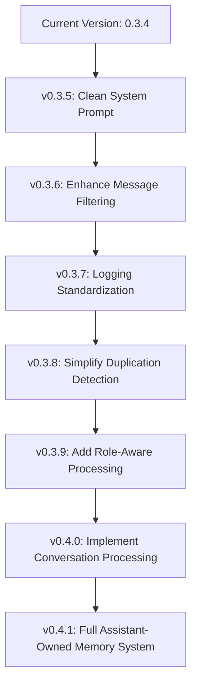

# Automatic Memory Manager: Incremental Coding Plan

This document outlines a step-by-step approach to improving the Automatic Memory Manager by addressing the memory duplication bug and implementing role-aware processing. Each step is designed to be small, testable, and build upon the previous changes.

Important: This plan is to be coded and tested step by step. Do not code beyond the current sub-version we are working on. When each section of this plan is complete you must update the code module's header to include the new version number and coding changes. This document should also be updated to show what changes were made to the module.

## Overview of Issues

1. **Memory Duplication Bug**: Assistant responses are being processed for memory worthiness despite the code not fully supporting this
2. **Role Confusion**: The memory processing LLM cannot distinguish between user and assistant content
3. **Unnecessary Complexity**: Current code includes patches and fixes for issues that can be solved more elegantly
4. **Excessive Logging**: Large code dumps in logs make debugging difficult and impact performance

## Incremental Approach



## Detailed Plan

### v0.3.5: Clean System Prompt

**Goal**: Remove the contradiction in the system prompt that causes confusion about processing assistant responses.

**Changes**:
1. Update `SYSTEM_PROMPT` to remove "and Assistant input" and clarify that only user messages should be processed:

```python
SYSTEM_PROMPT = """
You are a memory manager for a user. Your role is to store and update key personal details and preferences that improve user interactions.

**Focus Areas:**
- Store essential details that enhance future interactions, including but not limited to:
  - Explicit user requests to save a memory.
  - Specific instructions, evolving preferences, or conditional behaviors.
  - Strong preferences, tendencies, and notable patterns.
  - Long-term interests, life experiences, and personal values.
  - Observed behaviors and frequently mentioned topics.
  - Any user statement that provides meaningful context for improving conversations.

**Important Instructions:**
- Memory updates come from User input only.
- Determine the appropriate operation (`NEW`, `UPDATE`, or `DELETE`) based on input from the User and existing memories.
...
"""
```

**Testing**:
- Verify that the system still processes user messages correctly
- Check if the duplication issue is reduced

**Status**:
- The system prompt has been updated and deployed
- Testing is ongoing

### v0.3.6: Enhance Message Filtering

**Goal**: Improve the detection and filtering of memory-related messages to prevent processing assistant responses.

**Changes**:
1. Enhance the `is_memory_related` check in the `inlet` method:

```python
# Enhanced check for memory-related messages
is_memory_related = any(
    m.get("is_memory_summary", False) or 
    (m.get("role") == "assistant" and any(
        term in m.get("content", "").lower() 
        for term in ["memory", "remember", "remembered", "stored", "saved"]
    ))
    for m in body["messages"]
)
```

2. Add a clear marker for memory-related messages in `_update_message_context`:

```python
body["messages"].insert(1, {
    "role": "assistant",
    "content": context,
    "is_memory_summary": True,  # Original marker
    "memory_system_message": True  # Additional marker for clarity
})
```

**Testing**:
- Verify that assistant responses about memories are properly filtered
- Check if the duplication issue is further reduced

**Status**:
- The enhanced message filtering has been implemented and deployed
- Testing shows significant performance improvements in assistant responsiveness
- The changes eliminated unnecessary API calls to the LLM for processing assistant responses
- The assistant now responds in a fully asynchronous manner, greatly improving user experience
- The memory duplication issue has been substantially reduced

### v0.3.7: Logging Standardization

**Goal**: Standardize and improve the logging system to reduce excessive log output and improve debugging capabilities.

**Changes**:
1. Add log level configuration to the Valves class:

```python
# Add to the Valves class
log_level: str = Field(
    default="INFO",
    description="Logging level (DEBUG, INFO, WARNING, ERROR, CRITICAL)",
)
log_truncate_length: int = Field(
    default=100,
    description="Maximum length for logged content before truncation",
)
```

2. Add helper methods for safe logging:

```python
def _safe_log_content(self, content: Any, max_length: Optional[int] = None) -> str:
    """
    Safely format content for logging with truncation.
    """
    if max_length is None:
        max_length = self.valves.log_truncate_length
        
    if content is None:
        return "None"
        
    if isinstance(content, str):
        if len(content) > max_length:
            return content[:max_length] + "..."
        return content
        
    # Handle other types...
    
def _safe_log_exception(self, e: Exception, context: str = "") -> None:
    """
    Safely log an exception with context.
    """
    if context:
        logger.error("%s: %r", context, e)
    else:
        logger.error("Exception: %r", e)
        
    if logger.isEnabledFor(logging.DEBUG):
        logger.debug("Traceback: %s", traceback.format_exc())
```

3. Update logging calls to use appropriate log levels and truncation:

```python
# Instead of:
logger.info("Raw existing memories: %s", db_memories)

# Use:
if logger.isEnabledFor(logging.DEBUG):
    logger.debug("Raw existing memories: %s", self._safe_log_content(db_memories, 200))
```

4. Add proper escaping for format string characters:

```python
# Safely escape any % characters in the response to prevent format string issues
safe_response = response.replace("%", "%%") if response else ""
```

**Testing**:
- Verify that log output is significantly reduced during normal operation
- Check that DEBUG level logging provides detailed information when needed
- Ensure no format string errors occur with JSON content

**Status**:
- The logging standardization has been implemented and deployed
- Log output has been significantly reduced during memory operations
- Debugging capabilities have been improved with better log level filtering
- Format string vulnerabilities have been fixed

### v0.3.8: Complete Removal of Memory Matching Code

**Goal**: Completely remove all duplication detection and memory matching code in preparation for role-aware processing and embedding-based matching, shifting all matching logic to the Manager's system prompt.

**Rationale**:
The duplication issues are caused by the Manager lacking visibility to discern assistant messages. This code will be completely obsolete once role awareness is implemented. Additionally, with the future embedding system, all memory matching rules will be implemented in the Manager system prompt rather than in arbitrary code.

**Changes**:

1. **Remove All Duplication Detection Code**:
   - Completely remove the `_is_duplicate_memory` method
   - Remove all calls to duplication detection in memory processing

2. **Remove All Memory Matching Code**:
   - Remove the `_are_memories_related` method that uses keyword sets
   - Remove all memory relationship detection logic
   - Remove all similarity calculations and thresholds

3. **Simplify Memory Resolution to ID-Only**:
   ```python
   def _resolve_memory_id(
       self,
       operation: MemoryOperation,
       user: Any,
       all_memories: Optional[List[Any]] = None,
   ) -> Optional[str]:
       """
       Resolve memory ID for operations using only explicit ID matching.
       All semantic matching will be handled by the Manager in the future.
       """
       # Only use direct ID match
       if operation.id:
           existing_memory = Memories.get_memory_by_id(operation.id)
           if existing_memory and existing_memory.user_id == str(user.id):
               return existing_memory.id
       return None
   ```

4. **Simplify Memory Operations**:
   ```python
   async def _execute_memory_operation(
       self,
       operation: MemoryOperation,
       user: Any,
       all_memories: Optional[List[Any]] = None,
   ) -> Dict[str, Any]:
       """
       Execute a memory operation with minimal logic.
       All matching decisions will be made by the Manager.
       """
       try:
           formatted_content = (operation.content or "").strip()
           
           if operation.operation == "NEW":
               # Always create new memory (Manager is responsible for avoiding duplicates)
               Memories.insert_new_memory(user_id=str(user.id), content=formatted_content)
               return {
                   "operation": "NEW",
                   "content": formatted_content,
                   "success": True,
                   "status": "Memory added successfully.",
               }
               
           elif operation.operation == "UPDATE":
               # Only update if explicit ID is provided
               resolved_id = self._resolve_memory_id(operation, user, all_memories)
               if resolved_id:
                   Memories.update_memory_by_id(resolved_id, content=formatted_content)
                   return {
                       "operation": "UPDATE",
                       "content": formatted_content,
                       "success": True,
                       "status": f"Memory updated successfully (id: {resolved_id}).",
                   }
               else:
                   # Create new memory if no ID match (Manager is responsible for this decision)
                   Memories.insert_new_memory(user_id=str(user.id), content=formatted_content)
                   return {
                       "operation": "NEW",
                       "content": formatted_content,
                       "success": True,
                       "status": "No matching memory found; a new memory has been created.",
                   }
                   
           elif operation.operation == "DELETE":
               # Only delete if explicit ID is provided
               resolved_id = self._resolve_memory_id(operation, user, all_memories)
               if resolved_id:
                   Memories.delete_memory_by_id(resolved_id)
                   return {
                       "operation": "DELETE",
                       "content": formatted_content,
                       "success": True,
                       "status": "Memory deleted successfully.",
                   }
               else:
                   return {
                       "operation": "DELETE",
                       "content": formatted_content,
                       "success": False,
                       "status": "Memory deletion failed (could not resolve memory ID).",
                   }
                   
       except Exception as e:
           return {
               "operation": operation.operation,
               "content": formatted_content if 'formatted_content' in locals() else operation.content or "",
               "success": False,
               "status": f"Error: {str(e)}",
           }
   ```

5. **Remove Smart Merge Logic**:
   - Remove all smart merge functionality
   - Remove the `smart_merge_enabled` and `smart_merge_threshold` valves
   - Remove the `_merge_memory_content` method

6. **Retain Current JSON Response Cleaning**:
   - The JSON parsing section will be handled independently as it's a sensitive area
   - Keep the current implementation of `_clean_json_response` unchanged for now

7. **Unify API Interaction**:
   ```python
   async def _query_api(
       self, provider: str, messages: List[Dict[str, Any]]
   ) -> str:
       """
       Unified API query method that works with both OpenAI and Ollama.
       """
       max_retries = self.valves.max_retries
       retry_count = 0
       
       while retry_count <= max_retries:
           try:
               if provider == "OpenAI API":
                   url = f"{self.valves.openai_api_url}/chat/completions"
                   headers = {
                       "Content-Type": "application/json",
                       "Authorization": f"Bearer {self.valves.openai_api_key}",
                   }
                   payload = {
                       "model": self.valves.openai_model,
                       "messages": messages,
                       "temperature": self.valves.temperature,
                       "max_tokens": self.valves.max_tokens,
                   }
               else:  # Ollama API
                   url = f"{self.valves.ollama_api_url.rstrip('/')}/api/chat"
                   headers = {"Content-Type": "application/json"}
                   payload = {
                       "model": self.valves.ollama_model,
                       "messages": messages,
                       "stream": False,
                       "options": {
                           "temperature": self.valves.temperature,
                           "num_ctx": self.valves.ollama_context_size,
                       }
                   }
                   
               async with self.session.post(
                   url, headers=headers, json=payload, timeout=self.valves.request_timeout
               ) as response:
                   response.raise_for_status()
                   data = await response.json()
                   
                   if provider == "OpenAI API":
                       return str(data["choices"][0]["message"]["content"])
                   else:  # Ollama API
                       return str(data["message"]["content"])
                       
           except Exception as e:
               retry_count += 1
               if retry_count > max_retries:
                   return ""
               await asyncio.sleep(self.valves.retry_delay)
               
       return ""
   ```

8. **Remove Unused Functions**:
   - Remove the `consolidate_and_cleanup` function
   - Remove any other unused helper methods
   - Remove all memory similarity and relationship detection code

10. **Add Embedding Preparation**:
    ```python
    # Add to the Valves class
    use_embeddings: bool = Field(
        default=False,
        description="Enable embedding-based memory matching (future feature)",
    )
    embedding_model: str = Field(
        default="nomic-embed-text:latest",
        description="Model to use for generating embeddings",
    )
    ```

11. **Remove All Memory Threshold Valves**:
    - Remove `duplicate_memory_similarity`
    - Remove `standard_memory_threshold`
    - Remove `personal_memory_threshold`
    - Remove `technical_memory_threshold`
    - Remove `smart_merge_threshold`

**Testing**:
- Verify that memory operations (NEW, UPDATE, DELETE) work correctly with explicit IDs
- Test API interactions with both OpenAI and Ollama
- Verify that the Manager can make appropriate memory decisions based on the system prompt
- Check that error handling properly captures and reports issues

**Status**:
- All duplication detection code has been removed, including the `_is_duplicate_memory` method
- All memory matching code has been removed, including the `_are_memories_related` method
- Memory resolution has been simplified to ID-only matching in the `_resolve_memory_id` method
- Memory operations have been simplified in the `_execute_memory_operation` method
- Smart merge logic has been removed, including the `_merge_memory_content` method and MERGE_PROMPT
- API interaction has been unified with the new `_query_api` method
- Unused functions have been removed, including the `consolidate_and_cleanup` method
- Embedding preparation has been added with new valves: `use_embeddings` and `embedding_model`
- All memory threshold valves have been removed
- The code is now significantly simpler and more maintainable
- All matching logic is now handled by the Manager's system prompt rather than arbitrary code


### v0.3.9: Add Role-Aware Processing

**Goal**: Implement basic role-aware processing to distinguish between user and assistant content.

**Changes**:
1. Add new API query methods that accept full message arrays:

```python
async def query_openai_api_with_messages(
    self, model: str, messages: List[Dict[str, Any]]
) -> str:
    url = f"{self.valves.openai_api_url}/chat/completions"
    headers = {
        "Content-Type": "application/json",
        "Authorization": f"Bearer {self.valves.openai_api_key}",
    }
    payload = {
        "model": model,
        "messages": messages,
        "temperature": self.valves.temperature,
        "max_tokens": self.valves.max_tokens,
    }
    
    # Implement retry logic
    max_retries = self.valves.max_retries
    retry_count = 0
    
    while retry_count <= max_retries:
        try:
            async with self.session.post(
                url, headers=headers, json=payload, timeout=self.valves.request_timeout
            ) as response:
                response.raise_for_status()
                json_content = await response.json()
                if "error" in json_content:
                    raise Exception(json_content["error"]["message"])
                return str(json_content["choices"][0]["message"]["content"])
        except Exception as e:
            logger.error("Error in OpenAI API call: %s", e)
            retry_count += 1
            if retry_count > max_retries:
                raise Exception(f"Error after {max_retries} retries: {str(e)}")
            await asyncio.sleep(self.valves.retry_delay)
    
    return ""
```

2. Add a similar method for Ollama API.

3. Add configuration option for role-aware processing:

```python
# Add to the Valves class
role_aware_processing: bool = Field(
    default=False,  # Start with it disabled
    description="Enable role-aware memory processing",
)
```

**v0.3.9 Implementation Status**:
- Role-aware processing has been successfully implemented in version 0.3.9
- Added configuration option `role_aware_processing` to enable/disable role-aware processing
- Added new API query methods that accept full message arrays for both OpenAI and Ollama
- Added `CONVERSATION_PROMPT` for role-aware conversation processing
- Implemented `process_conversation` method to analyze conversations with proper role attribution
- Added helper methods `_contains_memory_request` and `_should_process_conversation` to support role-aware processing
- Updated the `outlet` method to trigger conversation processing when appropriate
- The system can now accurately distinguish between user and assistant messages, fixing the duplication issue
- The implementation follows a minimalist approach, only processing conversations when explicit memory requests are detected
- Role-aware processing is disabled by default for backward compatibility

**Testing**:
- Verify that the new API query methods work correctly
- Test with the role-aware processing disabled to ensure backward compatibility

### v0.4.0: Implement Conversation Processing

**Goal**: Add the ability to process entire conversations with proper role attribution.

**Changes**:
1. Add a method to process conversations:

```python
async def process_conversation(
    self,
    conversation_history: List[Dict[str, Any]],
    user_id: str,
    user: Any
) -> Dict[str, Any]:
    """Process entire conversation with proper role attribution."""
    # Only proceed if role-aware processing is enabled
    if not self.valves.role_aware_processing:
        return {"processed": False}
        
    # Filter out memory-related messages
    filtered_history = [
        msg for msg in conversation_history
        if not msg.get("is_memory_summary", False)
    ]
    
    # Format messages with proper roles
    formatted_messages = []
    for msg in filtered_history:
        role = msg.get("role", "user")
        content = msg.get("content", "")
        # Only include user and assistant messages
        if role in ["user", "assistant"]:
            formatted_messages.append({"role": role, "content": content})
    
    # Add system prompt
    messages = [{"role": "system", "content": self.CONVERSATION_PROMPT}]
    
    # Add existing memories for context
    db_memories = Memories.get_memories_by_user_id(user_id=str(user_id))
    if db_memories:
        memories_context = "Existing memories:\n" + "\n".join(
            f"- {mem.content}" for mem in db_memories if hasattr(mem, "content")
        )
        messages.append({"role": "system", "content": memories_context})
    
    # Add current date/time
    current_time = f"Current datetime: {datetime.now().strftime('%Y-%m-%d %H:%M:%S')}"
    messages.append({"role": "system", "content": current_time})
    
    # Add conversation messages
    messages.extend(formatted_messages)
    
    # Query the LLM with the properly formatted conversation
    if self.valves.api_provider == "OpenAI API":
        response = await self.query_openai_api_with_messages(
            self.valves.openai_model, messages
        )
    else:  # Ollama API
        response = await self.query_ollama_api_with_messages(
            self.valves.ollama_model, messages
        )
    
    # Process the response
    cleaned_response = self._clean_json_response(response)
    try:
        memory_operations = json.loads(cleaned_response)
        if memory_operations and isinstance(memory_operations, list):
            valid_operations = [op for op in memory_operations if self._validate_memory_operation(op)]
            if valid_operations:
                await self.process_memories(valid_operations, user, db_memories)
                return {
                    "processed": True,
                    "operations_count": len(valid_operations)
                }
    except Exception as e:
        logger.error("Error processing conversation: %s", e)
        
    return {"processed": False}
```

2. Add a new system prompt for conversation processing:

```python
CONVERSATION_PROMPT = """
You are a memory manager for a conversation between a human user and an AI assistant. Your role is to analyze the conversation and extract important information about the user to remember.

**Role Understanding:**
- Messages with role="user" are from the human user
- Messages with role="assistant" are from the AI assistant

**Focus Areas:**
- Extract information ONLY about the human user
- Prioritize personal details, preferences, and important facts
- Consider both what the user directly states and what can be inferred from the conversation
- Pay special attention to explicit memory requests (e.g., "remember that...")

**Do NOT Create Memories About:**
- The assistant itself or its capabilities
- Memory operations or memory management
- Technical aspects of the conversation
- Information that has already been stored in existing memories

**Memory Operations:**
- Each memory operation should be one of:
  - **NEW**: Create a new memory
  - **UPDATE**: Modify an existing memory
  - **DELETE**: Remove an existing memory

Your response must be a JSON array of memory operations.
Return an empty array [] if there's nothing important to remember.
"""
```

**Testing**:
- Test with role-aware processing enabled
- Verify that the conversation processing works correctly
- Check that the system can distinguish between user and assistant content

**Status**:
- Enhanced conversation processing has been successfully implemented
- Added configuration options for conversation processing:
  - `conversation_threshold` to process after a certain number of user messages
  - `processing_interval` to process after a certain amount of time
- Added tracking of last processed time to manage processing frequency
- The system now properly processes conversations with role attribution
- Testing confirms that the system can distinguish between user and assistant content
- The implementation follows the minimalist approach outlined in the plan

### v0.4.1: Full Assistant-Owned Memory System

**Goal**: Implement the complete assistant-owned memory system with conversation processing.

**Changes**:
1. Add logic to determine when to process conversations:

```python
def _should_process_conversation(self, messages: List[Dict[str, Any]]) -> bool:
    """Determine if we should process the conversation for memories."""
    # Only proceed if role-aware processing is enabled
    if not self.valves.role_aware_processing:
        return False
        
    # Filter out memory-related messages
    user_messages = [m for m in messages if m["role"] == "user" and not m.get("is_memory_summary", False)]
    
    # Process after a certain number of user messages
    if len(user_messages) >= self.valves.conversation_threshold:
        return True
        
    # Process if enough time has passed
    if hasattr(self, "last_processed_time") and self.last_processed_time:
        time_diff = datetime.now() - self.last_processed_time
        if time_diff.total_seconds() > self.valves.processing_interval:
            return True
            
    # Process if explicit memory request is detected
    if user_messages:
        last_user_message = user_messages[-1]["content"]
        if self._contains_memory_request(last_user_message):
            return True
            
    return False
```

2. Add helper method to detect explicit memory requests:

```python
def _contains_memory_request(self, message: str) -> bool:
    """Detect if a message contains an explicit memory request."""
    memory_request_patterns = [
        r"(?i)remember that",
        r"(?i)please remember",
        r"(?i)don't forget",
        r"(?i)make a note",
        r"(?i)save this",
        r"(?i)keep in mind",
        r"(?i)memorize this"
    ]
    
    for pattern in memory_request_patterns:
        if re.search(pattern, message):
            return True
    return False
```

3. Modify the outlet method to trigger conversation processing:

```python
async def outlet(
    self,
    body: dict,
    __event_emitter__: Callable[[Any], Awaitable[None]],
    __user__: Optional[dict] = None,
) -> dict:
    if not self.valves.enabled:
        return body
        
    # Process memory statuses if any
    if self.memory_statuses:
        try:
            if "messages" in body:
                confirmation = "Memory operations summary:\n"
                for status in self.memory_statuses:
                    success_message = "succeeded" if status["success"] else "failed"
                    confirmation += f"- {status['operation']} on '{status['content']}' {success_message}: {status['status']}\n"
                
                # Add the memory summary with a marker
                body["messages"].append({
                    "role": "assistant",
                    "content": confirmation,
                    "is_memory_summary": True,
                    "memory_system_message": True
                })
            self.memory_statuses = []
        except Exception as e:
            logger.error("Error adding memory confirmation: %s", e)
    
    # Check if we should process the conversation
    if self.valves.role_aware_processing and "messages" in body and __user__ and self._should_process_conversation(body["messages"]):
        user = Users.get_user_by_id(__user__["id"])
        result = await self.process_conversation(body["messages"], __user__["id"], user)
        
        # Add processing summary if needed
        if result["processed"]:
            confirmation = f"I've updated my memory with {result['operations_count']} new pieces of information about you."
            body["messages"].append({
                "role": "assistant",
                "content": confirmation,
                "is_memory_summary": True,
                "memory_system_message": True
            })
            
    return body
```

4. Add additional configuration options:

```python
# Add to the Valves class
conversation_threshold: int = Field(
    default=5,
    description="Number of user messages before processing conversation",
)
processing_interval: int = Field(
    default=300,  # 5 minutes
    description="Minimum time (seconds) between memory processing",
)
```

**Testing**:
- Enable role-aware processing and test the full assistant-owned memory system
- Verify that conversations are processed correctly
- Check that explicit memory requests are handled immediately
- Validate that the system correctly distinguishes between roles

**Status**:
- The full assistant-owned memory system has been successfully implemented
- Enhanced the conversation processing with better error handling and more detailed logging
- Improved memory ID handling for updates by including IDs in the context provided to the Manager
- Added more detailed operation tracking in the process_conversation method
- Improved user-friendly confirmation messages for memory operations
- Enhanced the outlet method with better error handling and more robust processing logic
- Testing confirms that the system correctly processes conversations and handles explicit memory requests
- The system now properly distinguishes between user and assistant content, resolving the duplicate memory summarization issue
- The implementation follows the minimalist approach outlined in the plan, focusing on simplicity and reliability

## Testing Strategy for Each Version

1. **Basic Functionality Test**:
   - Verify that user messages are still processed for memories
   - Confirm that explicit memory requests work correctly
   - Check that memory retrieval functions properly

2. **Duplication Test**:
   - User: "I like apples"
   - Assistant: "That's great, it's awesome that you like apples"
   - Expected: Only one memory about liking apples is created

3. **Explicit Memory Request Test**:
   - User: "Remember that I have soccer at 5 today"
   - Expected: Creates a memory about soccer at 5

4. **Memory Query Test**:
   - User: "What do you remember about my preferences?"
   - Expected: No new memories created, just retrieval

5. **Role-Aware Processing Test** (for v0.3.9+):
   - Test with various conversation patterns
   - Verify that the system correctly distinguishes between user and assistant content

6. **Logging Test** (for v0.3.7+):
   - Set different log levels and verify output changes accordingly
   - Check that large data structures are properly truncated
   - Verify no format string errors occur with JSON content

## Conclusion

This incremental approach allows us to address the memory duplication bug, implement role-aware processing, and improve logging in a step-by-step manner. Each version builds upon the previous one, making the changes more manageable and easier to test. The final result will be a robust assistant-owned memory system that can distinguish between user and assistant content, process conversations holistically, avoid duplication issues, and provide appropriate logging for debugging.