# Automatic Memory Manager Logging Redesign Plan

## 1. Problem Analysis

The current logging system in the AMM has several critical issues:
- Stack dumps appear in logs at all log levels (DEBUG to CRITICAL)
- These dumps occur on every memory operation
- The current `__repr__` and `__str__` methods are not preventing full code dumps
- Log level filtering is not working effectively for certain types of log messages
- Large data structures are being logged without proper truncation

## 2. Root Causes

Based on the code review and the log example provided, the likely root causes are:

1. **Ineffective Object Representation**:
   - Current string representation methods don't handle all logging contexts
   - Complex nested objects aren't properly truncated

2. **Direct Object Logging**:
   - Objects are being logged directly without using safe logging helpers
   - Format specifiers like `%s` are used on complex objects without proper handling

3. **Serialization Issues**:
   - Objects are being serialized to JSON or other formats without proper handling
   - No custom JSON serializers to prevent full code dumps

4. **Recursive References**:
   - Potential circular references causing entire object graphs to be dumped

5. **Inconsistent Log Level Application**:
   - Log level filtering not consistently applied across all logging calls

## 3. Proposed Solution Architecture

```mermaid
graph TD
    A[Logging System Redesign] --> B[Enhanced Object Representation]
    A --> C[Comprehensive Safe Logging]
    A --> D[Custom Serialization]
    A --> E[Global Log Interceptor]
    A --> F[Consistent Log Level Control]
    
    B --> B1[Robust __repr__ and __str__]
    B --> B2[Recursive Object Handling]
    B --> B3[Max Depth Control]
    
    C --> C1[Universal Safe Logging Decorator]
    C --> C2[Enhanced _safe_log_content]
    C --> C3[Context-Aware Logging]
    
    D --> D1[Custom JSON Encoder]
    D --> D2[Serialization Hooks]
    D --> D3[Truncation Policies]
    
    E --> E1[Pre-Log Filtering]
    E --> E2[Size-Based Truncation]
    E --> E3[Content Sanitization]
    
    F --> F1[Centralized Log Configuration]
    F --> F2[Operation-Specific Log Levels]
    F --> F3[Dynamic Log Control]
```



## 4. Detailed Implementation Plan

### 4.1 Enhanced Object Representation

1. **Implement Robust Base Class for Loggable Objects**:
   - Create a `LoggableMixin` class with comprehensive `__repr__` and `__str__` methods
   - Add support for recursive object handling with max depth control
   - Implement content truncation at multiple levels

```python
class LoggableMixin:
    """Base class for objects that need safe logging representation."""
    
    def __repr__(self, max_depth=1, current_depth=0):
        """
        Provide a concise representation for logging purposes.
        Controls recursion depth to prevent stack dumps.
        """
        if current_depth >= max_depth:
            return f"{self.__class__.__name__}(...)"
            
        # Class-specific representation logic
        attrs = self._get_repr_attributes()
        attrs_str = ", ".join(f"{k}={self._format_value(v, max_depth, current_depth+1)}" 
                             for k, v in attrs.items())
        return f"{self.__class__.__name__}({attrs_str})"
    
    def __str__(self):
        """Provide a human-readable string representation."""
        return self.__repr__(max_depth=0)
    
    def _get_repr_attributes(self):
        """Return a dict of attributes to include in representation."""
        # Override in subclasses
        return {}
    
    def _format_value(self, value, max_depth, current_depth):
        """Format a value for representation, handling recursion."""
        if value is None:
            return "None"
            
        if hasattr(value, "__repr__") and isinstance(value, LoggableMixin):
            return value.__repr__(max_depth, current_depth)
            
        if isinstance(value, str):
            if len(value) > 30:
                return f"'{value[:27]}...'"
            return f"'{value}'"
            
        if isinstance(value, (list, tuple)):
            if current_depth >= max_depth:
                return f"{type(value).__name__}[{len(value)} items]"
            items = [self._format_value(v, max_depth, current_depth+1) for v in value[:3]]
            if len(value) > 3:
                items.append("...")
            return f"{type(value).__name__}[{', '.join(items)}]"
            
        if isinstance(value, dict):
            if current_depth >= max_depth:
                return f"dict{{{len(value)} items}}"
            items = [f"{k}: {self._format_value(v, max_depth, current_depth+1)}" 
                    for k, v in list(value.items())[:3]]
            if len(value) > 3:
                items.append("...")
            return f"{{{', '.join(items)}}}"
            
        return repr(value)
```

2. **Update Filter and MemoryOperation Classes**:
   - Make them inherit from `LoggableMixin`
   - Implement `_get_repr_attributes` to control what's included in logs

```python
class Filter(LoggableMixin):
    """Auto-memory filter class expecting pure memory content (no tags)."""
    
    def _get_repr_attributes(self):
        """Return attributes for representation."""
        return {
            "version": "0.3.8",
            "valves_count": len(vars(self.valves)) if hasattr(self, "valves") else 0,
            "memories_count": len(self.stored_memories) if hasattr(self, "stored_memories") and self.stored_memories else 0
        }

class MemoryOperation(BaseModel, LoggableMixin):
    """Model for memory operations"""
    
    operation: Literal["NEW", "UPDATE", "DELETE"]
    id: Optional[str] = None
    content: Optional[str] = None
    
    def _get_repr_attributes(self):
        """Return attributes for representation."""
        content_preview = ""
        if self.content:
            content_preview = (self.content[:20] + "...") if len(self.content) > 20 else self.content
        return {
            "operation": self.operation,
            "id": self.id,
            "content_preview": content_preview
        }
```

### 4.2 Comprehensive Safe Logging

1. **Create Universal Safe Logging Decorator**:
   - Implement a decorator for logging methods that ensures safe logging
   - Handle exceptions, truncation, and log level filtering

```python
def safe_logging(func):
    """Decorator to ensure safe logging in any method."""
    @functools.wraps(func)
    def wrapper(self, *args, **kwargs):
        try:
            return func(self, *args, **kwargs)
        except Exception as e:
            # Safe exception logging
            self._safe_log_exception(e, f"Error in {func.__name__}")
            # Return a safe default value based on the function's return type
            return getattr(self, f"_default_{func.__name__}_result", None)
    return wrapper
```

2. **Enhance `_safe_log_content` Method**:
   - Add support for recursive object handling
   - Implement content-type-specific truncation policies
   - Add context awareness for different logging scenarios

```python
def _safe_log_content(self, content: Any, max_length: Optional[int] = None, 
                     context: str = "general", max_depth: int = 2) -> str:
    """
    Safely format content for logging with truncation and context awareness.
    
    Args:
        content: The content to format
        max_length: Maximum length before truncation (uses valve setting if None)
        context: Context of the logging (e.g., "memory", "api", "general")
        max_depth: Maximum depth for recursive object handling
            
    Returns:
        Safely formatted string representation of the content
    """
    if max_length is None:
        max_length = self.valves.log_truncate_length
        
    # Context-specific handling
    if context == "memory" and hasattr(content, "content"):
        # Special handling for memory objects
        return self._format_memory_for_logging(content, max_length)
    elif context == "api" and isinstance(content, dict):
        # Special handling for API responses
        return self._format_api_response_for_logging(content, max_length)
        
    # General content handling with recursive depth control
    return self._format_general_content(content, max_length, max_depth)
```

3. **Implement Context-Aware Logging Methods**:
   - Add specialized methods for different types of logging
   - Ensure consistent formatting and truncation

```python
def _log_memory_operation(self, operation: MemoryOperation, level: str = "INFO"):
    """Safely log a memory operation at the specified level."""
    log_func = getattr(logger, level.lower(), logger.info)
    if logger.isEnabledFor(getattr(logging, level)):
        log_func("Memory operation: %s", self._safe_log_content(operation, context="memory"))
        
def _log_api_request(self, request_data: Dict[str, Any], level: str = "DEBUG"):
    """Safely log an API request at the specified level."""
    log_func = getattr(logger, level.lower(), logger.debug)
    if logger.isEnabledFor(getattr(logging, level)):
        # Remove sensitive data like API keys
        sanitized_data = self._sanitize_api_data(request_data)
        log_func("API request: %s", self._safe_log_content(sanitized_data, context="api"))
```

### 4.3 Custom Serialization

1. **Implement Custom JSON Encoder**:
   - Create a JSON encoder that respects object representations
   - Add truncation for large string values
   - Handle circular references

```python
class SafeJSONEncoder(json.JSONEncoder):
    """JSON encoder that safely handles complex objects and prevents stack dumps."""
    
    def __init__(self, *args, **kwargs):
        self.max_string_length = kwargs.pop("max_string_length", 100)
        self.max_items = kwargs.pop("max_items", 10)
        self.seen_objects = set()
        super().__init__(*args, **kwargs)
        
    def default(self, obj):
        # Handle circular references
        obj_id = id(obj)
        if obj_id in self.seen_objects:
            return f"<circular reference to {obj.__class__.__name__}>"
        self.seen_objects.add(obj_id)
        
        # Handle LoggableMixin objects
        if isinstance(obj, LoggableMixin):
            return str(obj)
            
        # Handle other special types
        if hasattr(obj, "to_dict"):
            return obj.to_dict()
            
        if hasattr(obj, "__dict__"):
            return {k: v for k, v in obj.__dict__.items() 
                   if not k.startswith("_")}
                   
        return super().default(obj)
        
    def encode(self, obj):
        if isinstance(obj, str) and len(obj) > self.max_string_length:
            obj = obj[:self.max_string_length] + "..."
            
        if isinstance(obj, (list, tuple)) and len(obj) > self.max_items:
            obj = list(obj[:self.max_items]) + ["..."]
            
        if isinstance(obj, dict) and len(obj) > self.max_items:
            obj = {k: obj[k] for k in list(obj.keys())[:self.max_items]}
            obj["..."] = f"({len(obj) - self.max_items} more items)"
            
        return super().encode(obj)
```

2. **Add Serialization Hooks to Key Classes**:
   - Implement `to_dict` and `to_json` methods for key classes
   - Ensure these methods produce safe, truncated representations

```python
def to_dict(self) -> Dict[str, Any]:
    """Convert object to a dictionary suitable for serialization."""
    result = {}
    for key, value in self._get_repr_attributes().items():
        if isinstance(value, str) and len(value) > 30:
            result[key] = value[:27] + "..."
        else:
            result[key] = value
    return result
    
def to_json(self, **kwargs) -> str:
    """Convert object to a JSON string with safe encoding."""
    return json.dumps(self.to_dict(), cls=SafeJSONEncoder, **kwargs)
```

### 4.4 Global Log Interceptor

1. **Implement a Log Filter**:
   - Create a custom log filter that intercepts all log messages
   - Apply size-based truncation and content sanitization
   - Ensure log level filtering is consistently applied

```python
class AMMLimitFilter(logging.Filter):
    """Filter that limits the size of log messages and sanitizes content."""
    
    def __init__(self, max_length=1000):
        super().__init__()
        self.max_length = max_length
        
    def filter(self, record):
        # Always truncate message if it's too long
        if hasattr(record, "msg") and isinstance(record.msg, str) and len(record.msg) > self.max_length:
            record.msg = record.msg[:self.max_length] + "... [truncated]"
            
        # Sanitize args if they're too large
        if hasattr(record, "args") and record.args:
            record.args = self._sanitize_args(record.args)
            
        return True
        
    def _sanitize_args(self, args):
        """Sanitize log record args to prevent large dumps."""
        if not args:
            return args
            
        if isinstance(args, tuple):
            return tuple(self._sanitize_value(arg) for arg in args)
            
        return args
        
    def _sanitize_value(self, value):
        """Sanitize a single value for logging."""
        if isinstance(value, str) and len(value) > self.max_length:
            return value[:self.max_length] + "... [truncated]"
            
        if isinstance(value, (list, tuple)) and len(value) > 10:
            return f"{type(value).__name__} with {len(value)} items (first 3: {value[:3]})"
            
        if isinstance(value, dict) and len(value) > 10:
            return f"dict with {len(value)} items (sample: {dict(list(value.items())[:3])})"
            
        return value
```

2. **Configure Log Handlers**:
   - Set up log handlers with the custom filter
   - Ensure consistent formatting across handlers

```python
def _configure_logger(self) -> None:
    """Configure the logger based on the current valve settings."""
    log_level = getattr(logging, self.valves.log_level, logging.INFO)
    logger.setLevel(log_level)
    
    # Remove existing handlers to prevent duplication
    for handler in logger.handlers[:]:
        logger.removeHandler(handler)
        
    # Add console handler with custom filter
    console_handler = logging.StreamHandler()
    console_handler.setLevel(log_level)
    console_handler.setFormatter(logging.Formatter(
        '%(asctime)s - %(name)s - %(levelname)s - %(message)s'
    ))
    
    # Add the size limit filter
    limit_filter = AMMLimitFilter(max_length=self.valves.log_truncate_length)
    console_handler.addFilter(limit_filter)
    
    logger.addHandler(console_handler)
```

### 4.5 Consistent Log Level Control

1. **Centralize Log Configuration**:
   - Implement a central log configuration method
   - Ensure all logging calls respect the configured log level

```python
def _get_log_function(self, level: str) -> Callable:
    """Get the appropriate logging function based on level."""
    level = level.upper()
    if not hasattr(logging, level):
        level = "INFO"
    
    log_level = getattr(logging, level)
    if logger.isEnabledFor(log_level):
        return getattr(logger, level.lower())
    
    # Return a no-op function if the level is not enabled
    return lambda *args, **kwargs: None
```

2. **Add Operation-Specific Log Levels**:
   - Allow different log levels for different types of operations
   - Add valves for fine-grained control

```python
# Add to the Valves class
memory_op_log_level: str = Field(
    default="INFO",
    description="Log level for memory operations",
)
api_log_level: str = Field(
    default="INFO",
    description="Log level for API calls",
)
relevance_log_level: str = Field(
    default="INFO",
    description="Log level for memory relevance calculations",
)
```

3. **Implement Dynamic Log Control**:
   - Allow runtime adjustment of log levels
   - Add methods to temporarily change log levels for specific operations

```python
@contextlib.contextmanager
def temporary_log_level(self, level: str):
    """Temporarily change the log level for a specific operation."""
    original_level = self.valves.log_level
    try:
        self.valves.log_level = level
        self._configure_logger()
        yield
    finally:
        self.valves.log_level = original_level
        self._configure_logger()
```

## 5. Implementation Strategy

1. **Phase 1: Core Logging Infrastructure**
   - Implement `LoggableMixin` base class
   - Update `Filter` and `MemoryOperation` classes
   - Add the global log interceptor

2. **Phase 2: Enhanced Object Representation**
   - Implement robust `__repr__` and `__str__` methods
   - Add recursive object handling
   - Implement max depth control

3. **Phase 3: Safe Logging Methods**
   - Enhance `_safe_log_content` method
   - Add context-aware logging methods
   - Implement the safe logging decorator

4. **Phase 4: Custom Serialization**
   - Implement the custom JSON encoder
   - Add serialization hooks to key classes
   - Update all serialization code

5. **Phase 5: Log Level Control**
   - Centralize log configuration
   - Add operation-specific log levels
   - Implement dynamic log control

## 6. Testing Strategy

1. **Unit Tests**:
   - Test each logging component in isolation
   - Verify truncation and sanitization work correctly
   - Ensure log level filtering is applied consistently

2. **Integration Tests**:
   - Test the logging system with real memory operations
   - Verify no stack dumps occur at any log level
   - Check that log output is concise and readable

3. **Performance Tests**:
   - Measure the impact of logging on memory operations
   - Ensure logging doesn't significantly slow down the system
   - Verify log size is kept within reasonable limits

## 7. Expected Outcomes

1. **Elimination of Stack Dumps**:
   - No more full code dumps in logs at any log level
   - Concise, readable log messages for all operations

2. **Improved Debugging**:
   - More useful log messages that focus on relevant information
   - Better context for understanding what's happening

3. **Performance Improvement**:
   - Reduced log volume and processing overhead
   - Faster memory operations due to more efficient logging

4. **Enhanced Maintainability**:
   - Consistent logging approach throughout the codebase
   - Easier to add new logging without risking stack dumps