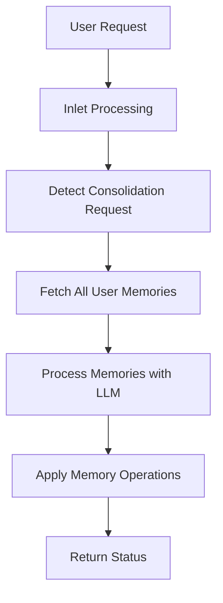

# AMM_v1_MMC Module Plan (Memory Management and Consolidation)

## Overview

The Memory Management and Consolidation (MMC) module is designed to consolidate existing memories based on their type, remove redundant information, and group details about similar topics into single memories. This module follows an LLM-first philosophy, using the language model for most of the processing while keeping code-enforced logic to a minimum.

## Module Structure



## Key Components

### 1. Basic Module Structure

The MMC module will follow a similar structure to the MIS module:

- `Filter` class with `Valves` for configuration
- Logger configuration
- API interaction methods
- Memory processing methods
- Inlet/outlet processing

### 2. Valves Configuration

```python
class Valves(BaseModel):
    # Enable/Disable Function
    enabled: bool = Field(
        default=True,
        description="Enable memory consolidation",
    )
    # Set processing priority
    priority: int = Field(
        default=4,  # Lower priority than MIS (3) and MRE (2)
        description="Priority level for the filter operations.",
    )  
    # UI settings
    show_status: bool = Field(
        default=True,
        description="Show memory consolidation status in chat",
    )
    # Debug settings
    verbose_logging: bool = Field(
        default=False,
        description="Enable detailed diagnostic logging",
    )
    max_log_lines: int = Field(
        default=10,
        description="Maximum number of lines to show in verbose logs for multi-line content",
    )
    # Background processing settings
    background_processing: bool = Field(
        default=True,
        description="Process memories in the background",
    )
    # API configuration
    api_provider: Literal["OpenAI API", "Ollama API"] = Field(
        default="Ollama API",
        description="Choose LLM API provider for memory processing",
    )
    # OpenAI settings
    openai_api_url: str = Field(
        default="https://api.openai.com/v1",
        description="OpenAI API endpoint",
    )
    openai_api_key: str = Field(
        default=os.getenv("OPENAI_API_KEY", ""),
        description="OpenAI API key",
    )
    openai_model: str = Field(
        default="gpt-4o-mini",
        description="OpenAI model to use for memory processing",
    )
    # Ollama settings
    ollama_api_url: str = Field(
        default="http://ollama:11434",
        description="Ollama API URL",
    )
    ollama_model: str = Field(
        default="qwen2.5:latest",
        description="Ollama model to use for memory processing",
    )
    ollama_context_size: int = Field(
        default=32768,
        description="Context size (n_ctx) for Ollama model",
    )
    # Common API settings
    request_timeout: int = Field(
        default=30,
        description="Timeout for API requests in seconds",
    )
    max_retries: int = Field(
        default=2,
        description="Maximum number of retries for API calls",
    )
    retry_delay: float = Field(
        default=1.0,
        description="Delay between retries (seconds)",
    )
    temperature: float = Field(
        default=0.3,
        description="Temperature for API calls",
    )
    max_tokens: int = Field(
        default=1000,
        description="Maximum tokens for API calls",
    )
    # Consolidation settings
    memory_similarity_threshold: float = Field(
        default=0.5,
        description="Minimum similarity threshold for consolidating memories (0.0-1.0)",
    )
    # Prompt storage with no default value (required field)
    consolidation_prompt: str = Field(
        ...,  # This makes the field required with no default
        description="Memory consolidation prompt with preserved formatting",
    )
```

### 3. Memory Consolidation Prompt

The consolidation prompt will be based on the integration prompt but modified to handle multiple memories at once. Key differences:

1. Focus on consolidating similar memories rather than integrating new information
2. Handle grouping of memories by category
3. Support for merging multiple memories into one
4. Special handling for reminders (as bulleted lists)

### 4. Core Functions

#### 4.1 Detect Consolidation Request

```python
def _is_consolidation_request(self, message: str) -> bool:
    """
    Determine if a message is requesting memory consolidation.
    
    Args:
        message: The user message
        
    Returns:
        True if the message is requesting consolidation, False otherwise
    """
    # Simple keyword matching for MVP
    consolidation_keywords = [
        "organize my memories",
        "consolidate my memories",
        "clean up my memories",
        "merge my memories",
        "organize memories",
        "consolidate memories"
    ]
    
    message_lower = message.lower()
    return any(keyword in message_lower for keyword in consolidation_keywords)
```

#### 4.2 Fetch All User Memories

```python
async def _fetch_all_memories(self, user_id: str) -> List[Any]:
    """
    Fetch all memories for a user.
    
    Args:
        user_id: The user ID
        
    Returns:
        List of memory objects
    """
    return Memories.get_memories_by_user_id(user_id)
```

#### 4.3 Process Memories with LLM

```python
async def _consolidate_memories(
    self, 
    user_message: str,
    db_memories: List[Any]
) -> List[Dict[str, Any]]:
    """
    Consolidate memories using LLM.
    
    Args:
        user_message: The user message requesting consolidation
        db_memories: List of memories from the database
        
    Returns:
        List of memory operations (NEW/UPDATE/DELETE)
    """
    # Format existing memories
    formatted_memories = self._format_memories(db_memories)
    
    # Format the system prompt
    system_prompt = self.valves.consolidation_prompt.format(
        user_message=user_message,
        existing_memories=formatted_memories,
        similarity_threshold=self.valves.memory_similarity_threshold
    )
    
    # Query the appropriate API
    if self.valves.api_provider == "OpenAI API":
        response = await self.query_openai_api(system_prompt, user_message)
    else:  # Ollama API
        response = await self.query_ollama_api(system_prompt, user_message)
    
    # Parse the response
    memory_operations = self._parse_json_response(response)
    
    return memory_operations
```

#### 4.4 Apply Memory Operations

This will reuse the `_process_memory_operations` method from the MIS module with minimal changes.

### 5. Inlet Processing

The inlet processing will detect consolidation requests and trigger the consolidation process:

```python
async def inlet(
    self,
    body: Dict[str, Any],
    __event_emitter__: Optional[Callable[[dict], Awaitable[None]]] = None,
    __user__: Optional[Dict[str, Any]] = None,
) -> Dict[str, Any]:
    """
    Process incoming messages (called by Open WebUI).
    Detects consolidation requests and triggers memory consolidation.
    
    Args:
        body: The message body
        __event_emitter__: Optional event emitter for notifications
        __user__: Optional user information
        
    Returns:
        The processed message body
    """
    # Basic validation
    if (
        not self.valves.enabled
        or not body
        or not isinstance(body, dict)
        or not __user__
    ):
        return body
    
    # Process only if we have messages
    if not body.get("messages"):
        return body
    
    try:
        # Check if there are any user messages
        user_messages = [m for m in body["messages"] if m.get("role") == "user"]
        if not user_messages:
            return body
        
        # Get the last user message
        last_user_message = user_messages[-1].get("content", "")
        if not last_user_message:
            return body
        
        # Check if this is a consolidation request
        if not self._is_consolidation_request(last_user_message):
            return body
        
        logger.info(
            "Detected memory consolidation request: %s",
            (
                last_user_message[:50] + "..."
                if len(last_user_message) > 50
                else last_user_message
            ),
        )
        
        # Get user object
        user = Users.get_user_by_id(__user__["id"])
        if not user:
            return body
        
        # If background processing is enabled, create a background task
        if self.valves.background_processing:
            # Initial status update
            if self.valves.show_status and __event_emitter__:
                self._non_blocking_emit(
                    __event_emitter__,
                    {
                        "type": "status",
                        "data": {
                            "description": "🧠 Consolidating memories (async)",
                            "done": False,
                        },
                    },
                )
            
            # Create and register background task
            logger.info("Creating background memory consolidation task")
            
            # Create the task
            task = asyncio.create_task(
                self._process_consolidation_background(
                    last_user_message, user, __user__["id"], __event_emitter__
                )
            )
            
            # Add task to set and set up callback for tracking and cleanup
            self.background_tasks.add(task)
            task.add_done_callback(self.background_tasks.discard)
            
            # Add a system message to acknowledge the consolidation request
            if "messages" in body:
                body["messages"].append({
                    "role": "assistant", 
                    "content": "I'll organize your memories. This will run in the background and I'll let you know when it's complete."
                })
            
            return body
        else:
            # Synchronous processing (not recommended for consolidation)
            # This is included for completeness but background processing should be used
            # for memory consolidation due to potentially large number of operations
            
            # Emit status update
            if self.valves.show_status and __event_emitter__:
                await self._safe_emit(
                    __event_emitter__,
                    {
                        "type": "status",
                        "data": {
                            "description": "🧠 Consolidating memories",
                            "done": False,
                        },
                    },
                )
            
            # Fetch all memories
            db_memories = Memories.get_memories_by_user_id(__user__["id"])
            if not db_memories:
                # No memories to consolidate
                if self.valves.show_status and __event_emitter__:
                    await self._safe_emit(
                        __event_emitter__,
                        {
                            "type": "status",
                            "data": {
                                "description": "☑ No memories to consolidate",
                                "done": True,
                            },
                        },
                    )
                
                # Add a system message to acknowledge the consolidation request
                if "messages" in body:
                    body["messages"].append({
                        "role": "assistant", 
                        "content": "I don't have any memories to organize yet."
                    })
                
                return body
            
            # Process consolidation
            memory_operations = await self._consolidate_memories(
                last_user_message, db_memories
            )
            
            # Process the memory operations
            self.memory_operations = await self._process_memory_operations(
                memory_operations, user
            )
            
            # Add a system message with the consolidation results
            if "messages" in body:
                body["messages"].append({
                    "role": "assistant", 
                    "content": f"I've organized your memories. {len(self.memory_operations)} operations performed."
                })
            
            return body
    
    except Exception as e:
        logger.error("Error in inlet: %s", e)
        import traceback
        logger.error("Traceback: %s", traceback.format_exc())
    
    return body
```

### 6. Background Processing

```python
async def _process_consolidation_background(
    self,
    user_message: str,
    user: Any,
    user_id: str,
    event_emitter: Optional[Callable[[dict], Awaitable[None]]] = None,
) -> None:
    """
    Process memory consolidation in the background.
    
    Args:
        user_message: The user message requesting consolidation
        user: The user object
        user_id: The user ID
        event_emitter: Optional event emitter for notifications
    """
    try:
        # Log background task start with timestamp
        import time
        start_time = time.time()
        logger.info("Background memory consolidation started")
        
        # Fetch all memories
        db_memories = Memories.get_memories_by_user_id(user_id)
        if not db_memories:
            # No memories to consolidate
            if self.valves.show_status and event_emitter:
                self._non_blocking_emit(
                    event_emitter,
                    {
                        "type": "status",
                        "data": {
                            "description": "☑ No memories to consolidate",
                            "done": True,
                        },
                    },
                )
                
                # Create a background task to clear the status after delay
                task = asyncio.create_task(
                    self._delayed_clear_status(event_emitter)
                )
                self.background_tasks.add(task)
                task.add_done_callback(self.background_tasks.discard)
            
            return
        
        # Process consolidation
        memory_operations = await self._consolidate_memories(
            user_message, db_memories
        )
        
        # If no memory operations, emit completion status and return
        if not memory_operations:
            if self.valves.show_status and event_emitter:
                self._non_blocking_emit(
                    event_emitter,
                    {
                        "type": "status",
                        "data": {
                            "description": "☑ No memory consolidation needed",
                            "done": True,
                        },
                    },
                )
                
                # Create a background task to clear the status after delay
                task = asyncio.create_task(
                    self._delayed_clear_status(event_emitter)
                )
                self.background_tasks.add(task)
                task.add_done_callback(self.background_tasks.discard)
            
            return
        
        # Process the memory operations
        self.memory_operations = await self._process_memory_operations(
            memory_operations, user
        )
        
        # Count operations by type
        new_count = 0
        update_count = 0
        delete_count = 0
        
        for op in self.memory_operations:
            if op.get("success", False):
                if op.get("operation") == "NEW":
                    new_count += 1
                elif op.get("operation") == "UPDATE":
                    update_count += 1
                elif op.get("operation") == "DELETE":
                    delete_count += 1
        
        # Create citation content for memory operations
        if self.memory_operations and event_emitter:
            citation_content = "Memory consolidation operations:\n"
            for op in self.memory_operations:
                status = "✅" if op.get("success", False) else "❌"
                operation = op.get("operation", "UNKNOWN")
                content = op.get("content", "")
                citation_content += f"{status} {operation}: {content}\n"
            
            # Send citation
            await self._send_citation(
                event_emitter,
                url="module://mmc/memories",
                title="Memories Consolidated",
                content=citation_content,
            )
        
        # Emit consolidated status update
        if self.valves.show_status and event_emitter:
            # Build a consolidated status message
            status_parts = []
            if new_count > 0:
                status_parts.append(f"{new_count} created")
            if update_count > 0:
                status_parts.append(f"{update_count} updated")
            if delete_count > 0:
                status_parts.append(f"{delete_count} deleted")
            
            if status_parts:
                status_message = f"🧠 Memory consolidation: {', '.join(status_parts)}"
            else:
                status_message = "🧠 Memory consolidation complete"
            
            # Send a single status update
            self._non_blocking_emit(
                event_emitter,
                {
                    "type": "status",
                    "data": {
                        "description": status_message,
                        "done": True,
                    },
                },
            )
            
            # Create only one background task to clear the status after delay
            task = asyncio.create_task(self._delayed_clear_status(event_emitter))
            self.background_tasks.add(task)
            task.add_done_callback(self.background_tasks.discard)
        
        # Log overall task completion with timing
        total_duration = time.time() - start_time
        logger.info(
            "Background memory consolidation completed in %.2f seconds", total_duration
        )
        
        # Add summary of operations
        total_ops = new_count + update_count + delete_count
        if total_ops > 0:
            logger.info(
                "Memory operations summary: %d created, %d updated, %d deleted",
                new_count,
                update_count,
                delete_count,
            )
        else:
            logger.info("No memory operations were performed")
        
        # Send a message to the user with the consolidation results
        if event_emitter:
            await self._safe_emit(
                event_emitter,
                {
                    "type": "message",
                    "data": {
                        "role": "assistant",
                        "content": f"I've organized your memories. {total_ops} operations performed ({new_count} created, {update_count} updated, {delete_count} deleted)."
                    },
                },
            )
    
    except Exception as e:
        # Enhanced error logging
        logger.error(
            "Error in background memory consolidation: %s",
            e,
        )
        import traceback
        logger.error("Traceback: %s", traceback.format_exc())
        
        # Emit error status
        if self.valves.show_status and event_emitter:
            self._non_blocking_emit(
                event_emitter,
                {
                    "type": "status",
                    "data": {
                        "description": "❌ Error consolidating memories",
                        "done": True,
                    },
                },
            )
```

## Consolidation Prompt Design

The consolidation prompt will be a new file called `MMC_Consolidation_Prompt_v1.md` with the following structure:

1. Introduction and task description
2. Memory categorization based on MIS_Identification_Prompt_Beta3.md
3. Consolidation rules and examples
4. Special handling for reminders
5. Output format specification

The prompt will instruct the LLM to:
1. Group memories by category and topic
2. Identify redundant or related memories
3. Merge related memories into comprehensive single memories
4. Format reminders as bulleted lists
5. Return a list of memory operations (NEW/UPDATE/DELETE)

## Implementation Steps

1. Create the MMC module file based on the MIS module structure
2. Create the consolidation prompt
3. Implement the core functions
4. Test with simple consolidation requests
5. Refine based on feedback

## Future Enhancements

1. Scheduled consolidation
2. Category-specific consolidation requests
3. Enhanced similarity detection
4. Memory relationship tracking
5. User feedback on consolidation results

## Implementation Status and Next Steps

The current implementation of the AMM_v1_MMC_Module.py file is incomplete. The following tasks need to be completed in the next session:

1. **Fix File Structure Issues**: The current file has structural problems with indentation and method organization. Some methods appear to be nested incorrectly within other methods.

2. **Complete Core Methods Implementation**:
   - Complete the `_process_consolidation_background` method which is currently cut off
   - Implement or fix the `inlet` method to properly detect consolidation requests
   - Implement the `outlet` method if needed

3. **Add Missing Helper Methods**:
   - Ensure all helper methods referenced in the plan are properly implemented
   - Check for any missing utility methods needed for memory operations

4. **Implement Error Handling**:
   - Add comprehensive error handling throughout the module
   - Ensure background tasks are properly tracked and cleaned up

5. **Testing and Validation**:
   - Test the module with various consolidation scenarios
   - Validate that memory operations (NEW/UPDATE/DELETE) work correctly
   - Test background processing functionality

6. **Integration with Prompt**:
   - Ensure the module correctly loads and uses the MMC_Consolidation_Prompt_v1.md file
   - Validate that the prompt formatting works correctly with the module

7. **Documentation**:
   - Add inline documentation for all methods
   - Update the module header with accurate version information

The recommended approach for the next session is to start with a clean implementation based on the plan rather than trying to fix the current file, as it appears to have significant structural issues.