# Automatic Memory Manager for Open WebUI v4: Conceptual Documentation

> **Note on Viewing Mermaid Diagrams**: This documentation contains Mermaid diagrams that require a compatible viewer. You can view them on GitHub, use VS Code with the "Markdown Preview Mermaid Support" extension, or use an online Mermaid viewer like [Mermaid Live Editor](https://mermaid.live/).

## 1. Overview of AMM v4

The Automatic Memory Manager (AMM) v4 is a sophisticated system designed to enhance Assistant interactions by automatically storing, retrieving, and managing User-related memories. It serves as a bridge between User conversations and a persistent Memory Database, allowing the Assistant to maintain context across multiple sessions. Version 4 features a dramatically simplified architecture with streamlined memory operations and improved message flow.

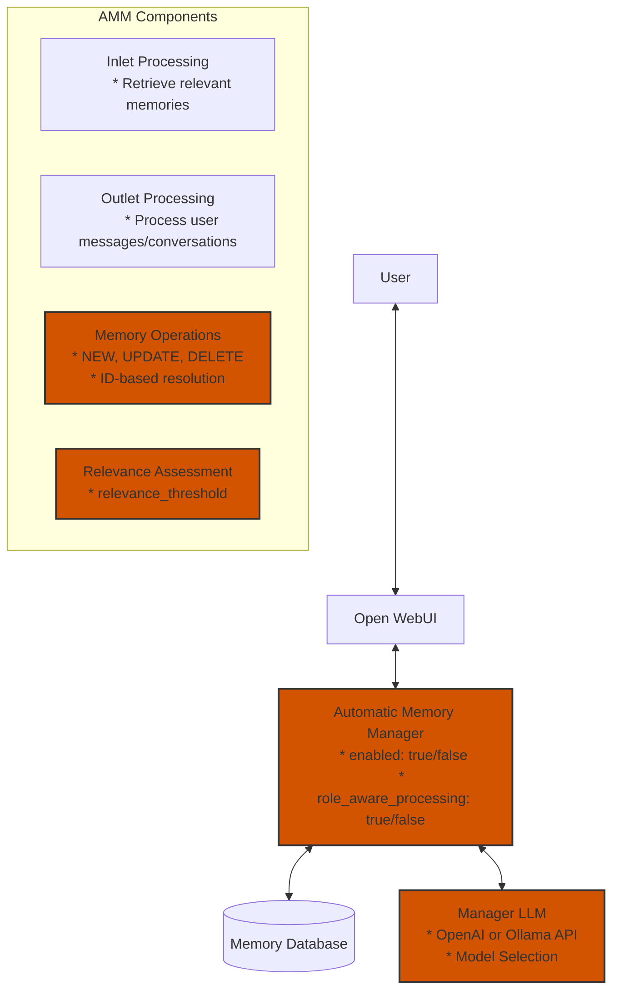

> **Note**: In v4, the architecture has been simplified with a clear separation of responsibilities. The Manager LLM makes decisions about memory operations, while the AMM module handles execution with minimal additional logic. Memory operations now rely exclusively on explicit ID matching.

### Key Components:

1. **Filter Class**: The main controller that orchestrates memory operations
2. **Inlet Processing**: Handles incoming messages, retrieves relevant memories
3. **Outlet Processing**: Processes outgoing messages, identifies new memories
4. **Memory Operations**: Manages NEW, UPDATE, and DELETE operations with simplified ID-based resolution
5. **API Integration**: Connects with OpenAI or Ollama for memory processing via the Manager
6. **Configurable Valves**: Settings that control the behavior of the system
7. **Role-Aware Processing**: Distinguishes between user and assistant messages for accurate memory extraction
8. **Memory Resolution**: Simplified to rely exclusively on explicit ID matching

## Terminology

To ensure clarity throughout this documentation, we use the following standardized terms:

- **User**: The real person interacting with the system
- **Assistant**: The external conversational LLM (ChatGPT, Claude, etc.) accessed via API
- **Manager**: The local LLM (OpenAI or Ollama model) that manages memory operations
- **Module**: The Python code implementation of the Automatic Memory Manager for Open WebUI
- **AMM**: Abbreviation for Automatic Memory Manager, used for brevity in diagrams
- **Memory Database**: The persistent storage system for User memories
- **Open WebUI**: The user interface application that integrates with the AMM
- **Valves**: Configurable parameters that control the behavior of the AMM

## 2. Core Memory Concepts

### Memory Operations

The AMM supports three fundamental operations:

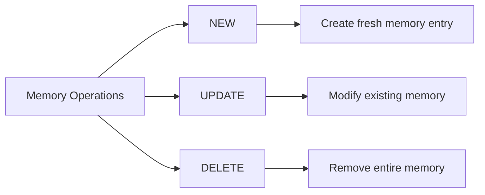

- **NEW**: Always creates a fresh memory entry when the User shares new information
- **UPDATE**: Modifies an existing memory if a valid ID is provided, otherwise creates a new memory
- **DELETE**: Removes a memory entirely if a valid ID is provided, otherwise the operation fails

### Memory Storage Structure

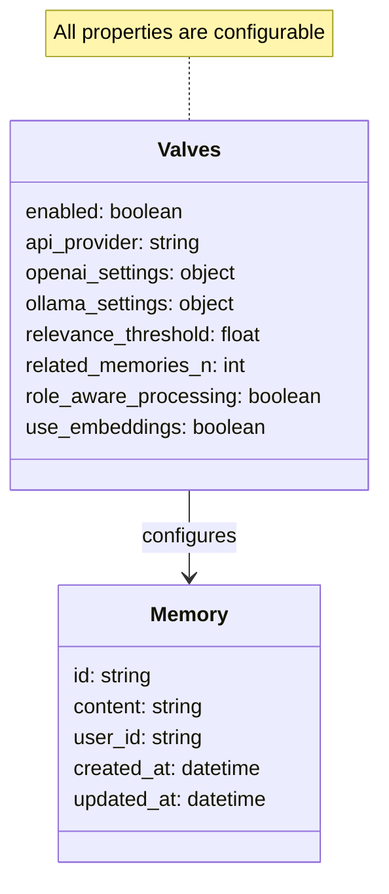

### Memory Relevance Determination

The system uses the Manager LLM to determine which memories are relevant to the current conversation:

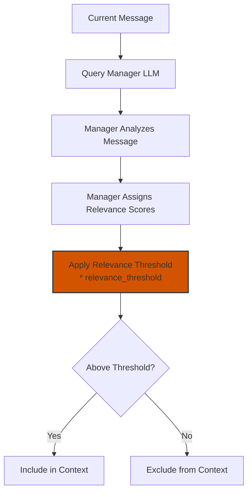

## 3. Data Flow Visualization

### End-to-End Data Flow

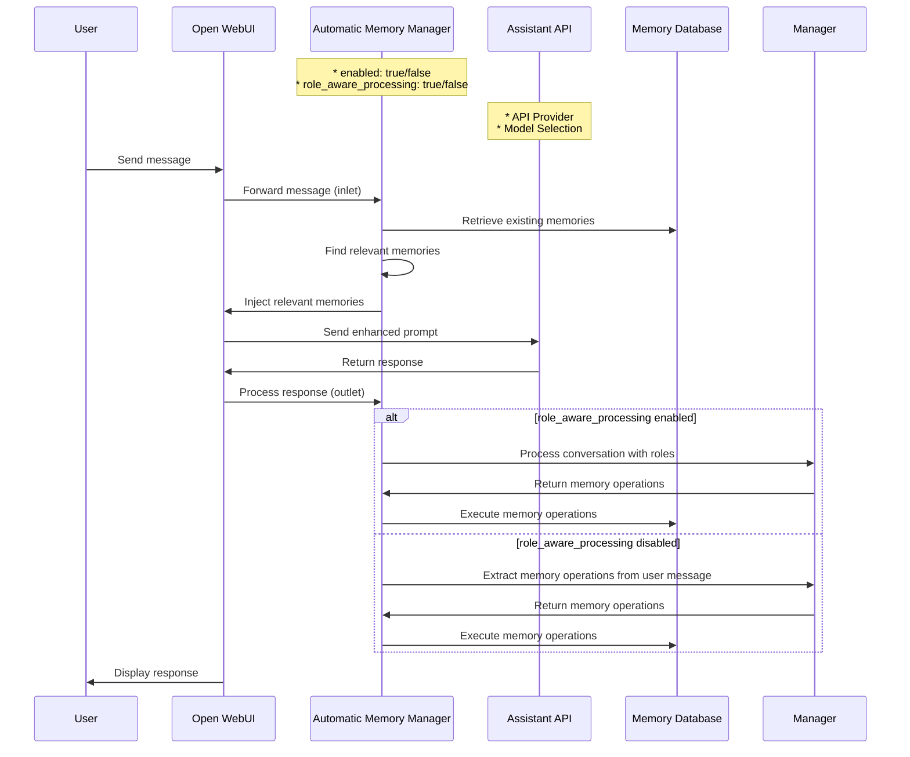

### Memory Retrieval Flow

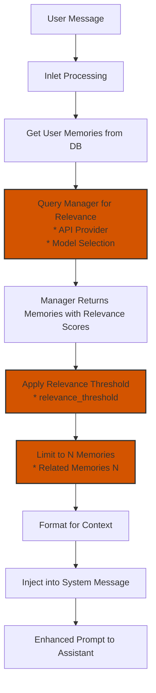

> **Note**: The current implementation asks the Manager to return memories with explicit relevance scores on a 0.0-1.0 scale. The system applies the configurable relevance threshold to filter out memories below the specified relevance level.

### Memory Storage Flow

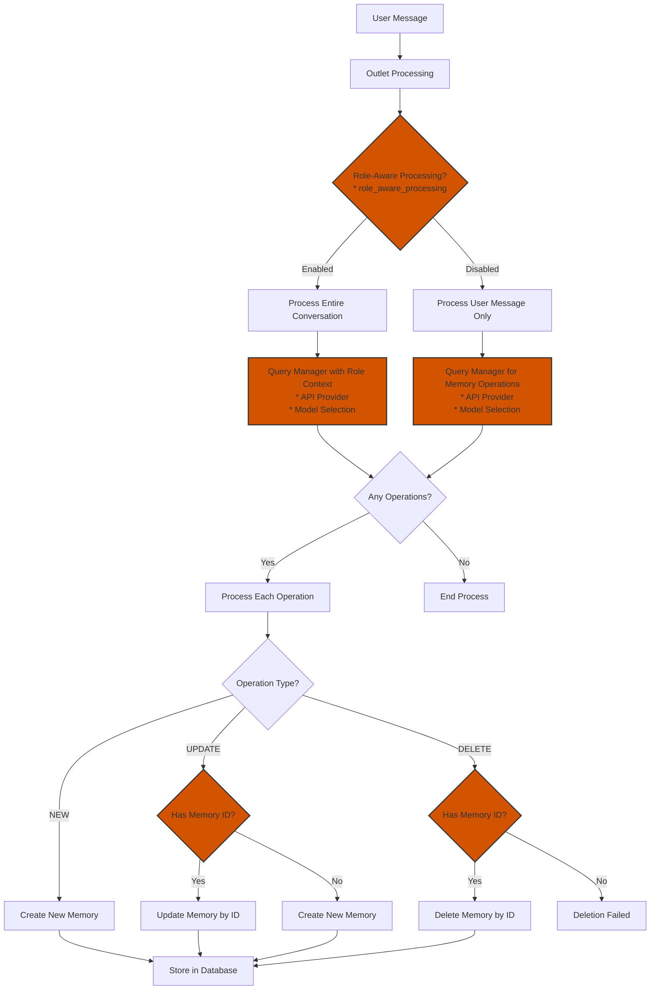

> **Note**: In v4, memory operations have been simplified to rely exclusively on explicit ID matching. For UPDATE operations, if no ID is provided, a new memory is created. For DELETE operations, an ID is required, and the operation fails if no ID is provided.

## 4. Memory Logic Flow

### Memory Identification Process

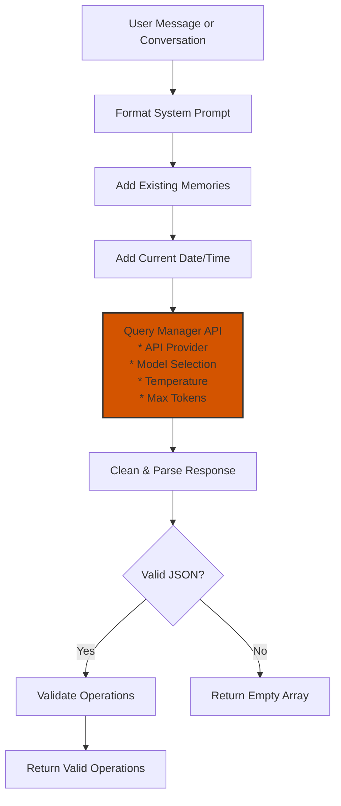

> **Note**: In v4, the memory identification process has been simplified to focus on extracting clear memory operations from user input. The Manager LLM is responsible for determining which operations to perform, while the AMM module handles the execution of these operations with minimal additional logic.

### Memory Resolution Process

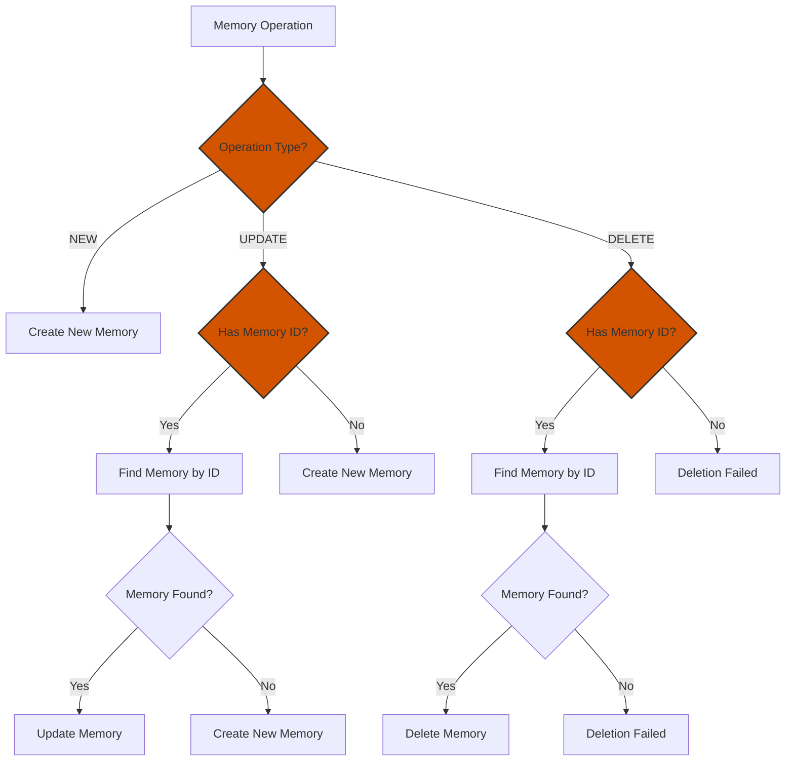

> **Note**: In v4, memory resolution has been simplified to focus on direct ID matching. The system no longer attempts to match memories based on content or semantic similarity. This simplification improves reliability and predictability of memory operations.

### Role-Aware Processing

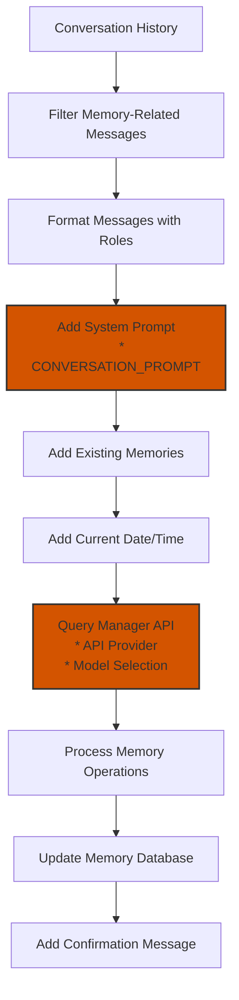

## 5. API Integration Flow

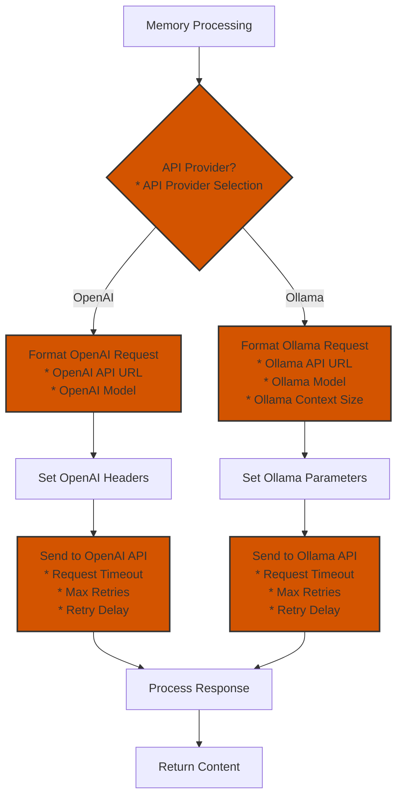

## 6. End-to-End User Experience

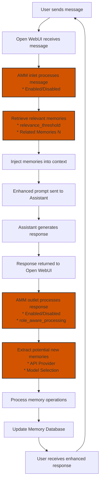

## 7. Memory Relevance Assessment

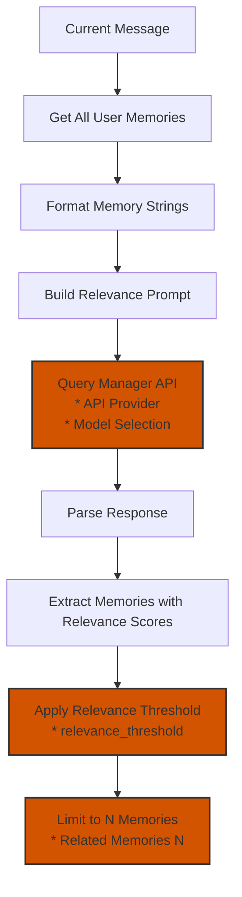

## 8. Configurable Valves Overview

The AMM v4 system includes numerous configurable parameters (Valves) that allow fine-tuning of its behavior. These are organized in the `Valves` class within the `Filter` class:

### General Settings
* `enabled`: Enable/disable the auto-memory filter
* `api_provider`: Choose Manager API provider for memory processing ("OpenAI API" or "Ollama API")
* `role_aware_processing`: Enable/disable role-aware memory processing (enabled by default)
* `conversation_threshold`: Number of user messages before processing conversation
* `processing_interval`: Minimum time (seconds) between memory processing

### OpenAI API Settings
* `openai_api_url`: OpenAI API endpoint
* `openai_api_key`: OpenAI API key
* `openai_model`: OpenAI model to use for the Manager

### Ollama API Settings
* `ollama_api_url`: Ollama API URL
* `ollama_model`: Ollama model to use for the Manager
* `ollama_context_size`: Context size (n_ctx) for Ollama model

### API Request Settings
* `request_timeout`: Timeout for API requests in seconds
* `max_retries`: Maximum number of retries for API calls
* `retry_delay`: Delay between retries (seconds)

### LLM Generation Settings
* `temperature`: Temperature for API calls
* `max_tokens`: Maximum tokens for API calls
* `related_memories_n`: Number of related memories to consider

### Memory Relevance Settings
* `relevance_threshold`: Minimum relevance score (0.0-1.0) for memories to be included in context (0 = disabled)

### Embedding Settings (Future Feature)
* `use_embeddings`: Enable embedding-based memory matching
* `embedding_model`: Model to use for generating embeddings

These configurable Valves allow users to customize the behavior of the AMM system to suit their specific needs and preferences.

## 9. Role-Aware Processing Implementation

The AMM v4 includes role-aware processing, which allows the system to distinguish between user and assistant messages when extracting memories. This is a significant improvement over earlier versions, which could not differentiate between the two roles, leading to potential duplication and confusion.

### Key Components of Role-Aware Processing

1. **CONVERSATION_PROMPT**: A specialized system prompt that instructs the Manager to analyze conversations with proper role attribution:
   ```
   You are a memory manager for a conversation between a human user and an AI assistant. Your role is to analyze the conversation and extract important information about the user to remember.

   **Role Understanding:**
   - Messages with role="user" are from the human user
   - Messages with role="assistant" are from the AI assistant
   ```

2. **process_conversation Method**: A dedicated method that processes entire conversations with proper role attribution:
   ```python
   async def process_conversation(
       self,
       conversation_history: List[Dict[str, Any]],
       user_id: str,
       user: Any
   ) -> Dict[str, Any]:
       """Process entire conversation with proper role attribution."""
       # Implementation details...
   ```

3. **Role-Aware API Methods**: New API query methods that accept full message arrays with role information:
   ```python
   async def query_openai_api_with_messages(
       self, model: str, messages: List[Dict[str, Any]]
   ) -> str:
       """Query OpenAI API with a full array of messages."""
       # Implementation details...
   ```

4. **Explicit Memory Request Detection**: Helper methods to detect when the user explicitly requests to remember something:
   ```python
   def _contains_memory_request(self, message: str) -> bool:
       """Detect if a message contains an explicit memory request."""
       # Implementation details...
   ```

5. **Conversation Processing Logic**: Logic to determine when to process conversations:
   ```python
   def _should_process_conversation(self, messages: List[Dict[str, Any]]) -> bool:
       """Determine if we should process the conversation for memories."""
       # Implementation details...
   ```

### Benefits of Role-Aware Processing

1. **Accurate Memory Extraction**: The system can now accurately distinguish between information provided by the user and responses from the assistant, ensuring that only user information is stored as memories.

2. **Reduced Duplication**: By understanding roles, the system avoids creating duplicate memories when the assistant repeats information provided by the user.

3. **Context-Aware Memory Creation**: The system can now understand the full context of a conversation, allowing for more accurate memory creation based on the entire exchange rather than isolated messages.

4. **Explicit Memory Request Handling**: The system can detect when the user explicitly asks to remember something, ensuring that important information is captured even if it might not be detected through standard processing.

5. **Backward Compatibility**: The role-aware processing feature can be enabled or disabled through the `role_aware_processing` valve, ensuring compatibility with existing implementations.

## 10. Summary of AMM v4 Memory Logic Flow

The Automatic Memory Manager v4 employs a dramatically simplified logic flow to manage memories, with numerous configurable Valves that allow fine-tuning of its behavior:

1. **Inlet Processing**:
   - Retrieves existing memories from the database
   - Determines which memories are relevant to the current conversation using relevance scores
   - Injects relevant memories into the context for the Assistant
   - **Configurable**: Relevance threshold, number of memories to retrieve

2. **Outlet Processing**:
   - With role-aware processing enabled: Analyzes entire conversations to identify information worth remembering
   - Without role-aware processing: Analyzes user messages only
   - Determines appropriate memory operations (NEW, UPDATE, DELETE)
   - Executes these operations on the Memory Database
   - **Configurable**: Role-aware processing

3. **Memory Operations**:
   - Dramatically simplified to rely exclusively on explicit ID matching
   - For UPDATE operations: Updates memory if ID is found, otherwise creates a new memory
   - For DELETE operations: Deletes memory if ID is found, otherwise fails
   - For NEW operations: Always creates a new memory
   - No content-based matching or semantic similarity assessment

4. **API Integration**:
   - Supports both OpenAI and Ollama for memory processing
   - Uses structured prompts to guide the Manager's memory decisions
   - Implements consistent retry logic and error handling for reliability
   - All API methods return empty strings on failure rather than raising exceptions
   - **Configurable**: API provider, model selection, request parameters

This system creates a seamless experience where the Assistant can remember important details about the User across conversations, leading to more personalized and contextually relevant interactions. The extensive configuration options allow for fine-tuning the system's behavior to match specific use cases and performance requirements.

## 11. Memory Flow Logic in v4

The AMM v4 has significantly simplified the memory flow logic compared to previous versions. This section explains the key changes and how memory operations are now processed.

### Key Simplifications in v4

1. **Explicit ID-Based Resolution**:
   - Memory operations now rely exclusively on explicit ID matching
   - No content-based matching or semantic similarity assessment
   - The system no longer attempts to find similar memories based on content

2. **Clear Decision Flow**:
   - NEW operations: Always create a new memory
   - UPDATE operations:
     * If memory ID is provided and found: Update the memory
     * If memory ID is provided but not found: Create a new memory
     * If no memory ID is provided: Create a new memory
   - DELETE operations:
     * If memory ID is provided and found: Delete the memory
     * If memory ID is provided but not found: Operation fails
     * If no memory ID is provided: Operation fails

3. **Manager vs. AMM Responsibilities**:
   - Manager LLM (OpenAI or Ollama): Responsible for determining which memory operations to perform
   - AMM Module: Responsible for executing these operations with minimal additional logic
   - This separation of concerns improves reliability and predictability

### Benefits of Simplified Memory Flow

1. **Improved Reliability**: By relying on explicit IDs rather than content matching, the system avoids ambiguity and potential errors in memory operations.

2. **Predictable Behavior**: The simplified logic makes the system's behavior more predictable and easier to reason about.

3. **Reduced Complexity**: The codebase is now more maintainable with fewer edge cases to handle.

4. **Better Performance**: Simpler logic means faster processing and less computational overhead.

## 12. Memory Relevance Scoring and Filtering

This section describes the memory relevance scoring and filtering system that has been implemented to address the issue of vaguely related memories being included in the context.

### Resolved Issue: Handling Vaguely Related Memories

**Previous Behavior**: The system would always return the top N memories as determined by the Manager, even when none were truly relevant to the current conversation. This meant that even when only vaguely related memories existed, the system would still inject these loosely related memories into the context, potentially degrading the quality of the Assistant's responses.

**Current Behavior**: The system now returns only genuinely relevant memories, with each memory having an explicit relevance score. A configurable threshold allows filtering out memories that fall below a specified relevance level.

### Implemented Solution: Hybrid Approach

A hybrid approach was implemented that balances philosophical principles (trusting the Manager's judgment) with technical robustness (explicit scoring and thresholds):

1. The Manager is instructed to return only genuinely relevant memories (filtering at the source)
2. Each returned memory includes a relevance score on a 0.0-1.0 scale
3. A configurable threshold valve filters out memories below the specified relevance score

This implementation provides several benefits:
- Reduces processing overhead by having the Manager return fewer memories
- Provides configurability through an explicit threshold
- Offers transparency through visible relevance scores
- Maintains consistency across different LLMs
- Uses a consistent 0.0-1.0 scale for all threshold parameters

### Implementation Details

1. **Prompt Modification**:
   - Updated the prompt in `get_relevant_memories` to instruct the Manager to only return memories that are genuinely relevant
   - Requested a relevance score (0.0-1.0) for each memory returned

2. **Response Format Change**:
   - Changed from a simple array of strings to an array of objects with memory text and score:
   ```json
   [
     {"text": "memory content 1", "score": 0.85},
     {"text": "memory content 2", "score": 0.72}
   ]
   ```

3. **New Valve**:
   - Added a `relevance_threshold` valve to the `Valves` class (default: 0.0 or disabled)
   - When set above 0, memories with scores below this threshold are filtered out

4. **Code Changes**:
   - Updated the response parsing logic in `get_relevant_memories` to handle the new format
   - Added filtering logic based on the threshold
   - Updated the memory formatting for context injection
   - Fixed logging to prevent format string errors

This enhancement significantly improves the quality of memory retrieval by ensuring that only truly relevant memories are included in the context, while providing flexibility through configurable thresholds.