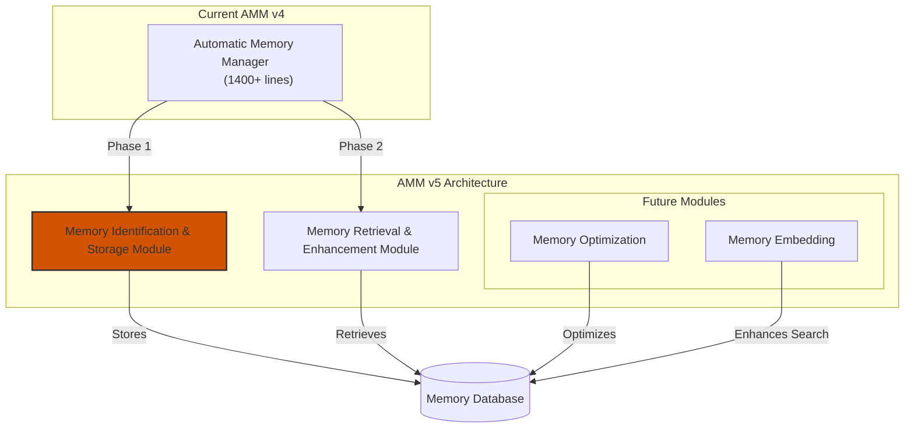

# Automatic Memory Manager v5: Modular Architecture Plan

## 1. Project Overview

The Automatic Memory Manager (AMM) v5 represents a significant architectural redesign of the current monolithic v4 implementation. This version will split the functionality into independent modules, each with a clear, focused responsibility. This modular approach will improve maintainability, flexibility, and extensibility while allowing Open WebUI administrators to enable or disable specific memory features as needed.

The implementation will take an incremental approach, starting with the Memory Identification & Storage (MIS) module that handles the outlet flow. This first phase will focus on extracting the MIS functionality with minimal changes to the v4 code, preserving the existing architecture, syntax, and methods. This approach reduces risk and ensures that the basic functionality works correctly before making more significant architectural changes.

## 2. Architectural Vision



The diagram highlights the MIS module as the focus of Phase 1, with the MRE module to follow in Phase 2. This phased approach allows for a more controlled and incremental transition to the modular architecture.

### 2.1 Core Modules

1. **Memory Identification & Storage (MIS)**
   - Identifies memory-worthy information from user messages and conversations
   - Manages memory operations (NEW, UPDATE, DELETE)
   - Processes conversations with role-aware analysis
   - Operates in the message outlet flow

2. **Memory Retrieval & Enhancement (MRE)**
   - Retrieves memories relevant to the current context
   - Scores and filters memories by relevance
   - Enhances prompts with relevant memories
   - Operates in the message inlet flow

### 2.2 Future Extension Modules

1. **Memory Optimization**
   - Identifies and merges duplicate memories
   - Combines related memories for better organization
   - Creates higher-level memory structures
   - Improves memory retrieval efficiency
   - Runs as a background process or on-demand
   - Uses sophisticated matching algorithms

2. **Memory Embedding**
   - Implements vector-based memory search
   - Generates embeddings for all memories
   - Enables semantic search capabilities

## 3. Implementation Plan

### 3.1 File Structure

```
/Open WebUI/Code/Automatic Memory Manager/
├── AMM_Memory_Identification_Storage.py  # Module 1: Complete standalone file
├── AMM_Memory_Retrieval_Enhancement.py   # Module 2: Complete standalone file
└── AMM_README.md                         # Documentation
```

### 3.2 Module Definitions

#### 3.2.1 Memory Identification & Storage Module

**Purpose**: Identify memory-worthy information from user messages and conversations, and manage memory operations.

**Key Responsibilities**:
- Process user messages to identify memory-worthy information
- Process conversations with role-aware analysis
- Execute memory operations (NEW, UPDATE, DELETE)
- Manage memory ID resolution
- Handle API interactions for memory identification

**Key Methods**:
- `identify_memories`: Identify memories from user input
- `process_memories`: Process memory operations
- `process_conversation`: Process conversation for memory extraction
- `outlet`: Process outgoing messages (called by Open WebUI)
- `_execute_memory_operation`: Execute a specific memory operation
- `_resolve_memory_id`: Resolve a memory ID for operations
- `_validate_memory_operation`: Validate a memory operation
- `_should_process_conversation`: Determine if conversation should be processed
- `_contains_memory_request`: Check if a message contains a memory request
- `_clean_json_response`: Clean and prepare API response for JSON parsing
- `_query_api`: Send a query to the API

#### 3.2.2 Memory Retrieval & Enhancement Module

**Purpose**: Retrieve relevant memories for the current context and enhance prompts with these memories.

**Key Responsibilities**:
- Retrieve memories relevant to the current context
- Score and filter memories by relevance
- Enhance prompts with relevant memories
- Handle API interactions for relevance assessment

**Key Methods**:
- `get_relevant_memories`: Get memories relevant to the current context
- `inlet`: Process incoming messages (called by Open WebUI)
- `_update_message_context`: Update message context with relevant memories
- `_format_existing_memories`: Format existing memories for context
- `_clean_json_response`: Clean and prepare API response for JSON parsing
- `_query_api`: Send a query to the API

### 3.3 Implementation Phases

#### Phase 1: MIS Module Implementation (v5.0.0)

1. **Create MIS Module with Minimal Changes**
   - Create the Memory_Identification_Storage.py file
   - Copy the core structure from AMM v4 with minimal changes
   - Focus only on the outlet flow functionality
   - Preserve existing code structure, syntax, and methods

2. **Extract Core MIS Functionality**
   - Copy all necessary methods from AMM v4 to MIS module
   - Keep all valves and configuration options for compatibility
   - Implement a simplified inlet method that just returns the body unchanged
   - Ensure the outlet method works exactly like in v4

3. **Test Basic Functionality**
   - Test the MIS module with Open WebUI to ensure it correctly:
     - Processes outgoing messages
     - Identifies memory-worthy information
     - Executes memory operations (NEW, UPDATE, DELETE)
     - Handles role-aware conversation processing

#### Phase 2: MRE Module Implementation (v5.1.0)

1. **Create MRE Module with Minimal Changes**
   - Create the Memory_Retrieval_Enhancement.py file
   - Extract inlet-related functionality from v4
   - Implement a simplified outlet method that just returns the body unchanged
   - Ensure the inlet method works exactly like in v4

2. **Test MRE Module**
   - Test the MRE module with Open WebUI
   - Verify memory retrieval and enhancement functionality
   - Ensure compatibility with the MIS module

#### Phase 3: Code Quality Improvements (v5.2.0)

1. **Standardize Method Naming**
   - Apply consistent naming conventions (public vs. private methods)
   - Rename methods for clarity and consistency

2. **Improve Error Handling**
   - Implement consistent error handling patterns
   - Add graceful degradation for API failures
   - Ensure proper error reporting

3. **Enhance Documentation**
   - Add comprehensive docstrings to all classes and methods
   - Document configuration options
   - Create usage examples

#### Phase 4: Performance Optimizations (v5.3.0)

1. **Implement Caching**
   - Add caching for expensive operations
   - Implement cache invalidation strategies

2. **Optimize API Interactions**
   - Batch API requests where possible
   - Implement connection pooling
   - Add proper timeouts and retries

3. **Improve Resource Management**
   - Ensure proper cleanup of resources
   - Implement context managers for resource management

#### Phase 5: Advanced Features (v5.4.0+)

1. **Implement Memory Optimization Module**
   - Create a standalone module for memory optimization
   - Implement deduplication and consolidation algorithms
   - Add configuration options for optimization criteria

2. **Implement Memory Embedding Module**
   - Create a standalone module for memory embedding
   - Integrate with embedding models
   - Implement vector-based memory search

## 4. Best Practices to Implement

### 4.1 Code Organization

- **Single Responsibility Principle**: Each class and method should have a single responsibility
- **Logical Grouping**: Group related methods together
- **Consistent Order**: Maintain a consistent order of methods (e.g., public methods first, then private)
- **Method Length**: Keep methods focused and reasonably sized (< 50 lines)

### 4.2 Naming Conventions

- **Public Methods**: No underscore prefix, form the module's API
- **Private Methods**: Single underscore prefix, for internal use only
- **Descriptive Names**: Use descriptive names for methods and variables
- **Consistent Terminology**: Use consistent terminology throughout the codebase

### 4.3 Error Handling

- **Graceful Degradation**: Ensure modules fail gracefully without affecting the user experience
- **Consistent Error Patterns**: Standardize error handling across all methods
- **Detailed Error Messages**: Provide informative error messages for debugging
- **Error Recovery**: Implement recovery mechanisms where appropriate

### 4.4 Type Annotations

- **Function Signatures**: Add complete type annotations to all method parameters and return values
- **Complex Types**: Define custom types for complex data structures
- **Optional Values**: Properly annotate optional values with `Optional[Type]`
- **Union Types**: Use `Union[Type1, Type2]` for parameters that accept multiple types

### 4.5 Documentation

- **Module-Level Docstrings**: Add comprehensive module-level documentation
- **Class Docstrings**: Document the purpose and usage of each class
- **Method Docstrings**: Add detailed docstrings to all public methods
- **Parameter Documentation**: Document all parameters, including types and constraints
- **Return Value Documentation**: Document return values and possible exceptions
- **Examples**: Include usage examples for complex methods

### 4.6 Configuration Management

- **Validation**: Add validation for all configuration values
- **Defaults**: Provide sensible defaults for all settings
- **Documentation**: Document each configuration option thoroughly
- **Grouping**: Group related configuration options together

### 4.7 Performance Optimization

- **Caching**: Implement caching for expensive operations
- **Lazy Loading**: Load resources only when needed
- **Batch Processing**: Process items in batches where appropriate
- **Asynchronous Operations**: Use async/await consistently for I/O-bound operations

### 4.8 Resource Management

- **Connection Pooling**: Use connection pooling for database and API connections
- **Proper Cleanup**: Ensure resources are properly closed when no longer needed
- **Context Managers**: Use context managers for resource management
- **Timeouts**: Implement appropriate timeouts for external calls

## 5. Integration with Open WebUI

Each module will be implemented as a self-contained Python file that conforms to the Open WebUI function interface:

1. **Memory Identification & Storage Module (Phase 1)**:
   - Implements the `outlet` method for processing outgoing messages
   - Implements a simplified `inlet` method that just returns the body unchanged
   - Includes all necessary configuration and functionality in a single file
   - Preserves all v4 functionality for the outlet flow

2. **Memory Retrieval & Enhancement Module (Phase 2)**:
   - Implements the `inlet` method for processing incoming messages
   - Implements a simplified `outlet` method that just returns the body unchanged
   - Includes all necessary configuration and functionality in a single file
   - Preserves all v4 functionality for the inlet flow

Each module will be completely independent and can be enabled or disabled separately by Open WebUI administrators. This approach allows for a gradual transition from the monolithic v4 implementation to the modular v5 architecture.

## 6. Testing Strategy

### 6.1 Unit Testing

- **Method-Level Tests**: Test each public method independently
- **Mock Dependencies**: Use mock objects for external dependencies
- **Edge Cases**: Test edge cases and error conditions
- **Parameter Validation**: Test parameter validation

### 6.2 Integration Testing

- **Module Interaction**: Test the interaction between modules
- **Open WebUI Integration**: Test integration with Open WebUI
- **End-to-End Flows**: Test complete memory flows (identification, storage, retrieval)

### 6.3 Performance Testing

- **Response Time**: Measure response time for key operations
- **Memory Usage**: Monitor memory usage
- **API Call Frequency**: Track the number of API calls
- **Caching Effectiveness**: Measure cache hit/miss rates

## 7. Migration Strategy

### 7.1 Parallel Operation

Initially, both AMM v4 and v5 modules will be available, allowing administrators to choose which version to use.

### 7.2 Data Compatibility

The new modules will be compatible with existing memory data, ensuring a smooth transition.

### 7.3 Configuration Migration

A utility will be provided to migrate configuration from AMM v4 to the new modules.

### 7.4 Gradual Adoption

Administrators can adopt the new modules gradually, starting with one module and adding others as needed.

## 8. Documentation Plan

### 8.1 Module Documentation

- **Purpose**: Document the purpose of each module
- **Configuration**: Document all configuration options
- **Methods**: Document all public methods
- **Examples**: Provide usage examples

### 8.2 Integration Documentation

- **Open WebUI Interface**: Document the Open WebUI function interface
- **Configuration**: Document how to configure the modules

## 9. Success Criteria

### 9.1 Phase 1 Success Criteria (MIS Module)

The MIS module implementation will be considered successful if it meets the following criteria:

1. **Minimal Changes**: Code structure and methods remain as close as possible to v4
2. **Outlet Functionality**: All outlet functionality from AMM v4 is preserved
3. **Compatibility**: Works with existing memory data
4. **Reliability**: Error handling is robust and the module fails gracefully
5. **Performance**: Performance is equal to or better than AMM v4

### 9.2 Overall Success Criteria

The complete AMM v5 implementation will be considered successful if it meets the following criteria:

1. **Functionality**: All functionality from AMM v4 is preserved
2. **Modularity**: Each module can function independently
3. **Flexibility**: Administrators can enable/disable each module independently
4. **Performance**: Performance is equal to or better than AMM v4
5. **Maintainability**: Code is well-organized, documented, and follows best practices
6. **Extensibility**: New modules can be added easily
7. **Reliability**: Error handling is robust and modules fail gracefully

## 10. Timeline

| Phase | Description | Estimated Duration |
|-------|-------------|-------------------|
| 1 | MIS Module Implementation | 1 week |
| 2 | MRE Module Implementation | 1 week |
| 3 | Code Quality Improvements | 2 weeks |
| 4 | Performance Optimizations | 2 weeks |
| 5 | Advanced Features | 4+ weeks |

Total estimated time: 10+ weeks

## 11. Conclusion

The AMM v5 modular architecture represents a significant improvement over the current monolithic implementation. By splitting the functionality into independent modules, we can improve maintainability, flexibility, and extensibility while allowing Open WebUI administrators to enable or disable specific memory features as needed.

This revised plan takes a more incremental approach by focusing first on implementing the MIS module with minimal changes to the v4 code. This approach reduces risk and ensures that the basic functionality works correctly before making more significant architectural changes. By starting with the outlet flow in the MIS module, we can establish a solid foundation for the modular architecture while maintaining compatibility with the existing system.

The overall vision for the v5 modular architecture remains the same, but the implementation strategy has been adjusted to prioritize stability and compatibility with the existing system. This approach will allow us to build a solid foundation for future improvements while minimizing disruption to the current functionality.