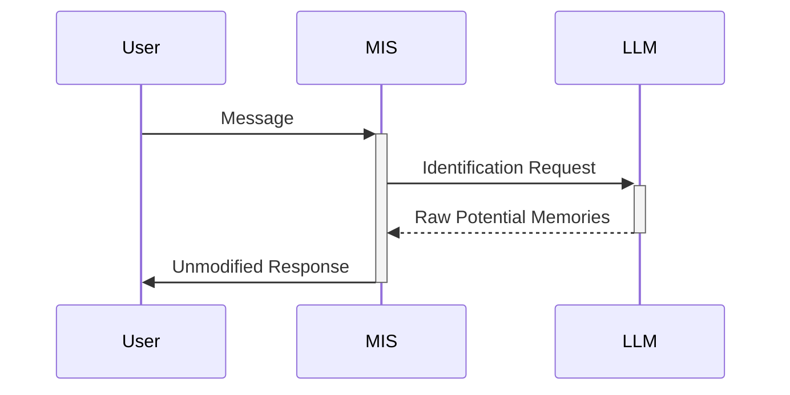

# AMM MIS v20 Coding Plan
**Base Version:** v16 (1.6.3)  
**Target File:** `Code/AMM_MIS_v20_Module.py`  
**Preserved Prompts:**
- `Prompts/MIS_Identification_Prompt_v9.md` (active use)
- `Prompts/MIS_Integration_Prompt_v8.md` (used by v16)

## 1. Structural Preservation Targets (v16 Lines)
```python
# PRESERVE LINES 25-143 (Core infrastructure)
''' 
▸ Logger configuration (25-41)
▸ Valves class skeleton (43-57)
▸ aiohttp session setup (127-134)
▸ __init__/close methods (114-125, 137-143)
'''

# PRESERVE LINES 176-201 (Identification core)
def _identify_potential_memories(self, message: str):
    '''Stage 1 logic without threshold checks'''
```

## 2. Streamlining Modifications
```python
# REMOVE LINES 204-214 (Threshold handling)
- '''Importance score filtering'''
- '''Stage 2 preparation'''

# REPLACE LINES 324-342 (Simplified inlet)
async def inlet(self, body: dict, __user__: dict) -> dict:
    '''Direct passthrough flow:'''
    current_message = extract_last_user_message(body)
    asyncio.create_task(self._log_identification(current_message))
    return body  # No modifications
```

## 3. Valve Configuration Changes
```diff
class Valves(BaseModel):
    # PRESERVE
    priority: int = 3
    ollama_model: str = "qwen2.5:latest"
    
    # REMOVE
-   integration_prompt: str = Field(...)
-   memory_relevance_threshold: float = 0.5
-   change_indicators: List[str] = [...]
```

## 4. New Identification Flow


## Implementation Sequence
1. Valve simplification (45 minutes)
   - Remove integration-related parameters
   - Update type hints

2. Core logic isolation (90 minutes)
   - Prune Stage 2 integration code
   - Disable citation system for stage 2, preserve citations related to stage 1

3. Flow modification (30 minutes)
   - Replace inlet() return logic
   - Add diagnostic logging

Ready for implementation. Switch to Act Mode when prepared to begin file modifications.
